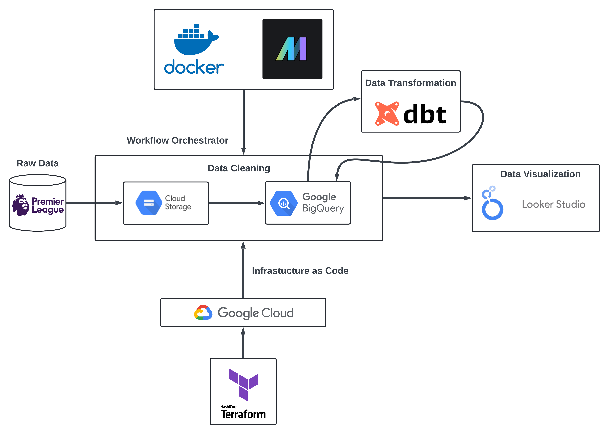
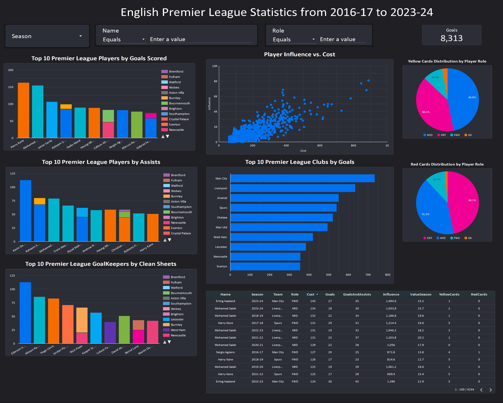

# Fantasy English Premier League Player Statistics Data Pipeline and Visualization

## Introduction
This project uses raw player data from the Fantasy Premier League provided by vaastav, [which can be found here](https://github.com/vaastav/Fantasy-Premier-League) and aims to provide some data visualization about players data ranging from the 2016-17 season up to 2023-24 by using data pipelines.

## Technologies Used
* **Infrastructure as Code**: Terraform
* **Platform as a Service**: Docker
* **Data Lake**: Google Cloud Storage
* **Workflow Orchestrator**: Mage AI
* **Data Warehouse**: Google BigQuery
* **Data Transformation**: Data Build Tool (dbt)
* **Dashboard**: Looker Studio


## Architecture



## Dashboard
You can access the [Dashboard here](https://lookerstudio.google.com/embed/reporting/5f51adbe-f19a-48c7-afe5-d815b6dbcf7f/page/nJ47D), which lets users filter data by season year, player name, and role.


## Reproducibility

### Google Cloud Platform (GCP)
* Ensure the following APIs are installed
  * BigQuery API
  * Bigquery Storage API
  * IAM Service Account Credentials API
* Setup a Service Account in GCP (with roles as Storage Admin and BigQuery Admin) and download a key (recommended in a .json format)

### Terraform
* Ensure your have Terraform installed (if using VsCode, you can download the Hashicorp Terraform extension)
* Define your infrastructure names, their location along with your GCP credentials (.json file) in main.tf or you can create a variables file (variables.tf) to define.
  * Google's credentials could also be initialized through the terminal with `export GOOGLE_CREDENTIALS = 'PATH to credits.json"`
```
terraform init
terraform plan
terraform apply
```
* You can destroy these infrastuctures using `terraform destroy`

### Mage AI
* Mage AI can be installed through docker
  ```
  cd mage-epl-stats/mage-quickstart
  docker-compose up
  ```
  Once in there, modify io_config.yaml to include your GCP credentials using the .json file
* There exists two data pipelines, one for exporting the data to GCS while the other to BigQuery after cleaning it (will add a scheduling for the 2024-25 season once it begins).

### Data Transformation
* This project used dbt cloud as the IDE to perform data transformation in BigQuery in order to obtain the correct tables to properly visualize the data.
* The dbt models can be built with `dbt build` and new packages could be installed in packages.yaml along with `dbt deps`
